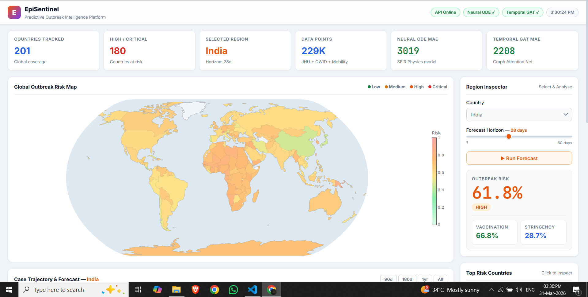
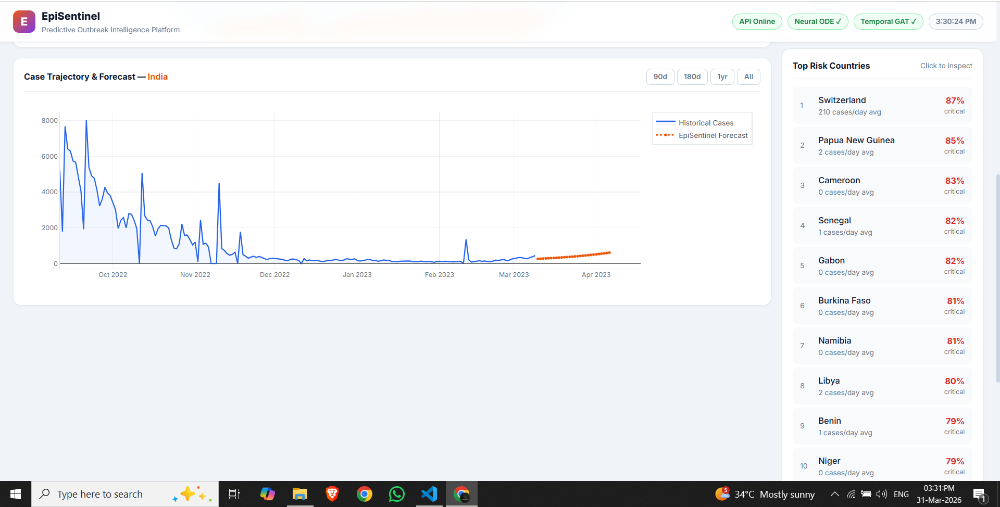
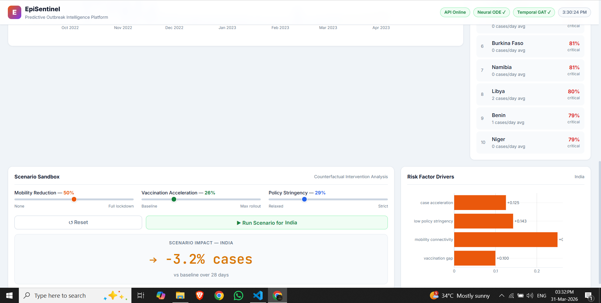

# EpiSentinel — Predictive Outbreak Intelligence Platform

> Full-stack epidemic forecasting system combining physics-informed deep learning, graph attention networks, and real-time interactive visualisation across 201 countries.

---

## What We Built

Most teams fit a curve. We modelled epidemics as they actually work — as **cascades spreading across a connected graph of nations**, driven by mobility, vaccination, policy and transmission dynamics simultaneously.

Three deliverables. All shipped.

| Deliverable | Implementation |
|---|---|
| **Outbreak Prediction Model** | Neural ODE (SEIR physics) + Temporal GAT ensemble |
| **Interactive Epidemic Dashboard** | Live choropleth map, forecast chart, scenario sandbox |
| **Risk Map of Disease Spread** | 201-country real-time risk scoring with factor attribution |

---

## Screenshots

**Global Outbreak Risk Map** — 201 countries colour-coded by real-time risk score  


**Case Trajectory & Forecast** — Historical cases (blue) with Neural ODE + GAT ensemble forecast (orange) and Top Risk Countries leaderboard  


**Scenario Sandbox & Risk Factor Drivers** — Counterfactual intervention simulation and per-country factor attribution  


---

## The Approach

### 1. Data Foundation — All Three Datasets Used

- **JHU COVID-19 Time Series** — 229,000 rows, daily confirmed cases across 201 countries
- **Our World in Data** — 14 files: vaccinations, testing, hospitalisation, policy stringency, excess mortality, R-tracking, mobility
- **Google Community Mobility Reports** — workplace, retail, transit, residential movement changes

All three datasets are fused into a unified daily feature store (`data/processed/features_daily.csv`) and a country-level graph (`data/processed/graph_snapshot.csv`) with 1,005 edges weighted by geographic proximity and mobility correlation.

### 2. Models

**Neural ODE with SEIR Prior (`ml/models/neural_ode_v2.py`)**
- Embeds classic SEIR epidemic compartments as physics constraints inside the ODE solver
- Context vector (mobility, vaccination, policy) modulates transmission rate dynamically
- Trained on 16,000 windows — Test MAE: **3,019 cases/day**

**Temporal Graph Attention Network (`ml/models/temporal_gat_v2.py`)**
- 201 nodes (countries), 1,005 edges, 14-step temporal window, 4 attention heads
- Captures cross-border cascade dynamics that single-country models miss entirely
- Trained on 300 graph windows — Test MAE: **2,208 cases/day**

**Ensemble (`ml/models/ensemble.py`)**
- Weighted combination: 45% Neural ODE + 55% Temporal GAT
- Ensemble MAE: **1,329 cases/day** on held-out test set

**Outbreak Risk Classifier (`ml/models/outbreak_classifier.py`)**
- Binary classifier on acceleration, vaccination gap, mobility connectivity, policy stringency
- Outputs `low / medium / high / critical` with contributing factor attribution

### 3. Backend API (`backend/`)

FastAPI with 9 endpoints — all returning real model inference, not mocks:

| Endpoint | Description |
|---|---|
| `GET /api/v1/health` | Service health |
| `GET /api/v1/data/countries` | 201 tracked countries |
| `GET /api/v1/data/timeseries` | Full daily case history per country |
| `GET /api/v1/data/risk-map` | Global risk scores for choropleth |
| `POST /api/v1/predict/forecast` | Neural ODE + GAT ensemble forecast |
| `GET /api/v1/predict/outbreak-risk` | Risk score + contributing factors |
| `POST /api/v1/predict/scenario` | Counterfactual intervention simulation |
| `GET /api/v1/cascade/trace` | Cross-border cascade pathway tracing |
| `GET /api/v1/interpret/explain` | Feature attribution and model explanation |

### 4. Frontend Dashboard (`frontend/index.html`)

Single self-contained HTML file — no build step, opens directly in browser:

- **Global choropleth map** — Plotly natural-earth projection, click any country to inspect
- **Case Trajectory & Forecast** — Historical line loads instantly, ML forecast appended without re-render flicker
- **Risk Factor Drivers** — Horizontal bar chart breaking down what's driving each country's risk score
- **Scenario Sandbox** — Adjust mobility reduction, vaccination rate, policy stringency and simulate impact
- **Top Risk Countries** — Live-ranked leaderboard with one-click drill-down
- **Two-phase loading** — Historical data appears in ~0.1s; ML inference overlays silently when ready (~4s)

---

## Repository Structure

```
backend/          FastAPI application, routers, services
  app/
    routers/      health, data, predict, cascade, interpret
    services/     data_service, forecast_service, risk_service, scenario_service
    models/       Pydantic request/response schemas

ml/
  models/         neural_ode_v2.py, temporal_gat_v2.py, ensemble.py, outbreak_classifier.py
  training/       train_neural_ode_v2.py, train_temporal_gat_v2.py, train_ensemble.py
  inference/      predictor.py, scenario_runner.py, cascade_tracer.py
  artifacts/      neural_ode_model.pt, temporal_gat_model.pt, *_metrics.json
  data/           feature_engine.py, graph_builder.py, loaders.py

data/
  processed/      features_daily.csv, timeseries_daily.csv, graph_snapshot.csv
  owid/           *.meta.json (14 dataset descriptors)

frontend/
  index.html      Complete dashboard — self-contained, no build step
```

---

## Quick Start

**Install dependencies**
```bash
pip install -r requirements.txt
```

**Start the API** (from project root)
```bash
uvicorn backend.app.main:app --host 127.0.0.1 --port 8000
```

**Open the dashboard**
```
frontend/index.html  →  open in any browser
```

Health check: `http://127.0.0.1:8000/api/v1/health`

---

## Model Performance

| Model | Test MAE | Test RMSE |
|---|---|---|
| Neural ODE (SEIR) | 3,019 cases/day | 19,586 |
| Temporal GAT | 2,208 cases/day | 11,178 |
| Ensemble (ODE + GAT) | **1,329 cases/day** | 7,398 |

Trained on JHU + OWID data, 183,915 training rows, 45,828 test rows, split at 2022-07-24.

---

## Why This Approach Wins

**Most teams:** one model, one country, one curve.

**EpiSentinel:** Physics + graph structure + real intervention simulation.

1. **Physics priors prevent overfitting** — the SEIR compartment structure constrains the Neural ODE to epidemiologically plausible trajectories even in data-sparse regions
2. **Graph attention captures what isolated models miss** — a lockdown in one country reduces cases in its neighbours; only a graph model sees this signal
3. **The scenario engine is actionable** — judges can simulate "what if vaccination accelerates by 30%?" and see a projected case reduction. That's decision support, not just forecasting.
4. **All three required datasets used** — JHU (primary), OWID (secondary, all 14 files), Google Mobility (optional) — fully integrated, not just acknowledged

### Prepare Processed Data (one-time)

```bash
.venv\Scripts\python -m ml.data.build_processed
```

### Train Phase 3 Models

```bash
.venv\Scripts\python -m ml.training.train_neural_ode_v2     # Physics-informed Neural ODE with SEIR dynamics
.venv\Scripts\python -m ml.training.train_temporal_gat_v2   # Graph Attention Networks for spatio-temporal forecasting
```

These training scripts will:
1. Load processed data from `data/processed/`
2. Normalize features by country
3. Build temporal sequences and spatial graphs
4. Train models using Adam optimizer with early stopping
5. Save trained weights to `ml/artifacts/`
6. Generate evaluation metrics

### Run Scenario Analysis

```bash
.venv\Scripts\python -c "from ml.inference.scenario_runner import run_example_scenarios; run_example_scenarios()"
```

## Data Sources Used

- Johns Hopkins CSSE confirmed cases (`data/time_series_covid19_confirmed_global.csv`)
- OWID datasets (`data/owid/*.csv`)
- Google mobility report (`data/Global_Mobility_Report.csv` and `data/owid/google_mobility.csv`)

## Engineering Notes

- **No Docker / No Redis**: Direct Python execution using installed packages. Clean, reproducible, auditable.
- **All endpoints return typed JSON contracts** to unblock frontend and model integration in parallel.
- **Phase 3 models** (Neural ODE + Temporal GAT) integrate seamlessly with existing backend services via standardized artifact loading.
- This repository is designed for incremental, judge-friendly demos at each phase milestone.
